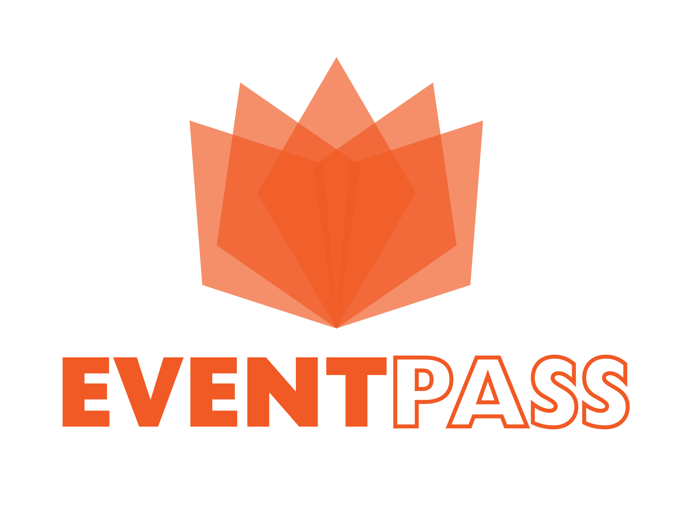

# EventPASS: Conectando você aos melhores momentos.

`Analise de desenvolvimento sistemas`

`Eixo 3 - Projeto: Desenvolvimento de uma Aplicação Móvel em um Ambiente de Negócio - Turma 04`

`2024/1`

Apresentamos o EventPASS, a sua solução inovadora para simplificar a experiência de compra e distribuição de ingressos para eventos. O EventPASS é uma aplicação interativa que revoluciona a forma como as pessoas participam de eventos, proporcionando uma plataforma ágil e conveniente para a venda e distribuição de ingressos.

Com o EventPASS, nunca foi tão fácil garantir sua presença nos eventos mais aguardados. Nossa plataforma oferece uma experiência intuitiva, permitindo que os usuários naveguem por uma ampla variedade de eventos culturais, esportivos e de entretenimento. Ao utilizar o EventPASS, você poderá escolher os eventos que mais lhe interessam e adquirir seus ingressos em questão de segundos.

Este projeto busca redefinir a maneira como as pessoas se envolvem com eventos, oferecendo uma abordagem inovadora para a compra de ingressos que é rápida, conveniente e simples. Prepare-se para uma nova era de acesso facilitado a momentos inesquecíveis com o EventPASS.

## Integrantes

- Fernanda Marques Assis
- Julia Chaves Dutra
- Luiz Eduardo Possidonio
- Pedro Celso Mendes
- Samara Almeida
- Sandro Shayne Dutra

## Orientador

* Diego Roberto Gonçalves de Pontes

## Instruções de utilização

Assim que a primeira versão do sistema estiver disponível, deverá complementar com as instruções de utilização. Descreva como instalar eventuais dependências e como executar a aplicação.

# Documentação

<ol>
<li><a href="docs/01-Documentação de Contexto.md"> Documentação de Contexto</a></li>
<li><a href="docs/02-Especificação do Projeto.md"> Especificação do Projeto</a></li>
<li><a href="docs/03-Metodologia.md"> Metodologia</a></li>
<li><a href="docs/04-Projeto de Interface.md"> Projeto de Interface</a></li>
<li><a href="docs/05-Arquitetura da Solução.md"> Arquitetura da Solução</a></li>
<li><a href="docs/06-Template Padrão da Aplicação.md"> Template Padrão da Aplicação</a></li>
<li><a href="docs/07-Programação de Funcionalidades.md"> Programação de Funcionalidades</a></li>
<li><a href="docs/08-Plano de Testes de Software.md"> Plano de Testes de Software</a></li>
<li><a href="docs/09-Registro de Testes de Software.md"> Registro de Testes de Software</a></li>
<li><a href="docs/10-Plano de Testes de Usabilidade.md"> Plano de Testes de Usabilidade</a></li>
<li><a href="docs/11-Registro de Testes de Usabilidade.md"> Registro de Testes de Usabilidade</a></li>
<li><a href="docs/12-Apresentação do Projeto.md"> Apresentação do Projeto</a></li>
<li><a href="docs/13-Referências.md"> Referências</a></li>
</ol>

# Código

<li><a href="src/README.md"> Código Fonte</a></li>

# Apresentação

<li><a href="presentation/README.md"> Apresentação da solução</a></li>
