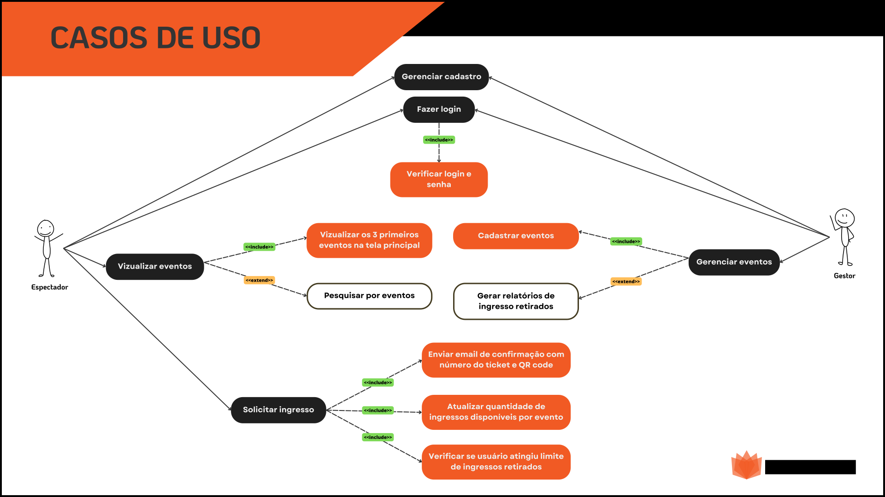

# Especificações do Projeto

Os membros da equipe realizaram um trabalho de imersão para consolidar a definição do problema e os pontos mais relevantes a serem abordados neste projeto, contando com a participação dos usuários por meio de observações em seu ambiente habitual, estudos e pesquisas. Os detalhes coletados foram organizados em personas e histórias de usuários para guiar o design e desenvolvimento do produto ou serviço.

## Personas

Durante o processo de estudo foram coletadas informações como idade, ocupação, motivação e frustrações. das personas identificadas durante o processo de entendimento do problema. As personas são apresentadas nas figuras a seguir:

|                                                                                        |                                                                           |                                                         |
| -------------------------------------------------------------------------------------- | ------------------------------------------------------------------------- | ------------------------------------------------------- |
| **Ricardo lima - 43 anos**                     | **Ocupação:** Prefeito de Quartel São João Mg.                            | **Dispositivos:** Notebook, Smartphone e Tablet.        |
| **Motivações:** Buscas constantementes para aprimorar a gestão pública de sua cidade.. | **Frustrações:** Recursos financeiros limitados, infraestrutura precaria. | **Hobbies:** Leitura, caminhadas e sair com a familia . |

|                                                                      |                                                                      |                                                          |
| -------------------------------------------------------------------- | -------------------------------------------------------------------- | -------------------------------------------------------- |
| **Luciana Texeira - 21 anos**  | **Ocupação:** Estudante de farmacia.                                 | **Dispositivos:** Smartphone e Notebook.                 |
| **Motivações:** Formar e conseguir a independencia financeira.       | **Frustrações:** Cidade pequena com poucas oportunidades de emprego. | **Hobbies:** Sair com amigos para se divertir e natação. |

|                                                                         |                                                                                                       |                                                         |
| ----------------------------------------------------------------------- | ----------------------------------------------------------------------------------------------------- | ------------------------------------------------------- |
| **Rogério Martins - 38 anos**    | **Ocupação:** Produtor de eventos.                                                                    | **Dispositivos:** Smartphone,Notebook e tablet.         |
| **Motivações:** Proporcionar momentos memoráveis e unicos para publico. | **Frustrações:** Orçamentos restritos das prefeituras, concorrência acirrada e alterações climaticas. | **Hobbies:** Teatro, cozinhas para os amigos e viagens. |

|                                                                      |                                                                                            |                                                                      |
| -------------------------------------------------------------------- | ------------------------------------------------------------------------------------------ | -------------------------------------------------------------------- |
| **Maria Julia Souza - 15 anos**  | **Ocupação:** Colegial.                                                                    | **Dispositivos:** Smartphone.                                        |
| **Motivações:** Sonha em ser uma ifluencer digital.                  | **Frustrações:** Falta de diversidade cultural, monotonia e acesso limitado de tecnologia. | **Hobbies:** Assitir series, passeios com amigos da escola e tiktok. |

## Histórias de Usuários

Com base na análise das personas identificadas na etapa anterior, foram identificadas as seguintes histórias de usuários:

| EU COMO... `PERSONA` | QUERO/PRECISO ... `FUNCIONALIDADE`                                              | PARA ... `MOTIVO/VALOR`                                                                                                                    |
| -------------------- | ------------------------------------------------------------------------------- | ------------------------------------------------------------------------------------------------------------------------------------------ |
| Espectador           | Visualizar os eventos disponíveis na minha cidade                               | Escolher qual evento melhor se adapta aos meus interesses e agenda.                                                                        |
| Espectador           | Realizar a compra de ingressos de eventos do meu interesse de forma online      | Garantir o meu ingresso para o evento em qualquer horário e de forma mais rápida, sem ter que me deslocar a uma bilheteria física.         |
| Espectador           | Receber meus ingressos de acesso ao evento em formato virtual                   | Evitar o deslocamento para retirada ou impressão do ingresso físico.                                                                       |
| Gestor do evento     | Realizar o controle de retirada de ingressos de um evento de forma automatizada | Ter maior controle e acesso mais rápido a informações relevantes, como número de participantes, para melhor adequar a estrutura do evento. |
| Gestor do evento     | Entregar para o espectador do evento um ingresso virtual                        | Reduzir os custos da fase de distribuição de ingressos, eliminando a impressão e equipes envolvidas na logística de entrega dos ingressos. |
| Gestor do evento     | Fornecer ingressos confiáveis que permitam validação rápida no acesso ao evento | Evitar ação de cambistas e falsificação de ingressos.                                                                                      |

## Requisitos

As tabelas que se seguem apresentam os requisitos funcionais e não funcionais que detalham o escopo do projeto.
Os requisitos funcionais são a funcionalidades essenciais para o funcionamento da aplicação.
Os requisitos não funcionais não impedem o funcionamento da aplicação e está relacionadao diretamente em como as funcionalidades serão entregues ao usuário do software.

### Requisitos Funcionais

| ID     | Descrição do Requisito                                                                                                                                     | Prioridade |
| ------ | ---------------------------------------------------------------------------------------------------------------------------------------------------------- | ---------- |
| RF-001 | A aplicação deve permitir gerenciamento de cadastros.                                                                                                      | ALTA       |
| RF-002 | A aplicação deve conter perfis de gestor de eventos e espectador.                                                                                          | ALTA       |
| RF-003 | A aplicação deve permitir o gerenciamento do evento pelo gestor.                                                                                           | ALTA       |
| RF-004 | A aplicação deve permitir o espectador pesquisar o evento pelo nome.                                                                                       | ALTA       |
| RF-005 | A aplicação deve exibir os próximos 3 eventos na tela principal.                                                                                           | MÉDIA      |
| RF-006 | A aplicação deve garantir que ao cadastrar o evento, o gestor informe a atração, o local, a data e a quantidade de ingressos disponíveis.                  | ALTA       |
| RF-007 | A aplicação deve permitir o gerenciamento dos ingressos retirados pelo espectador.                                                                         | ALTA       |
| RF-008 | A aplicação deve enviar um e-mail de confirmação de reserva para o espectador.                                                                             | MÉDIA      |
| RF-009 | A aplicação deve possibilitar ao gestor do evento gerar relatório geral do evento com dados do eventos, ingressos disponíveis e ingressos já distribuídos. | BAIXA      |

### Requisitos não Funcionais

| ID      | Descrição do Requisito                                                                                                                                   | Prioridade |
| ------- | -------------------------------------------------------------------------------------------------------------------------------------------------------- | ---------- |
| RNF-001 | A aplicação deve ser responsiva para rodar em todos os dispositivos.                                                                                     | MÉDIA      |
| RNF-002 | A aplicação deve processar requisições do usuário em no máximo 10s.                                                                                      | BAIXA      |
| RNF-003 | Apenas espectadores previamente cadastrados e logados poderão gerar ingressos                                                                            | MÉDIA      |
| RNF-004 | A aplicação deve ser compatível com os principais navegadores do mercado.                                                                                | ALTA       |
| RNF-005 | A aplicação deve seguir boas práticas de SEO. Isso inclui técnicas de otimização on-page e garantir a facilidade de rastreamento pelos motores de busca. | ALTA       |

Com base nas Histórias de Usuário, enumere os requisitos da sua solução. Classifique esses requisitos em dois grupos:

- [Requisitos Funcionais
  (RF)](https://pt.wikipedia.org/wiki/Requisito_funcional):
  correspondem a uma funcionalidade que deve estar presente na
  plataforma (ex: cadastro de usuário).
- [Requisitos Não Funcionais
  (RNF)](https://pt.wikipedia.org/wiki/Requisito_n%C3%A3o_funcional):
  correspondem a uma característica técnica, seja de usabilidade,
  desempenho, confiabilidade, segurança ou outro (ex: suporte a
  dispositivos iOS e Android).
  Lembre-se que cada requisito deve corresponder à uma e somente uma
  característica alvo da sua solução. Além disso, certifique-se de que
  todos os aspectos capturados nas Histórias de Usuário foram cobertos.

## Restrições

O projeto está restrito pelos itens apresentados na tabela a seguir.

| ID      | Restrição                                                                                                                            |
| ------- | ------------------------------------------------------------------------------------------------------------------------------------ |
| RST-001 | O projeto deverá ser entregue até o final do semestre                                                                                |
| RST-002 | A geração de ingressos estará sujeita a uma restrição, sendo permitida a emissão de no máximo 3 unidades por usuário em cada evento. |
| RST-003 | O desenvolvimento da solução não poderá ser subcontratado                                                                            |

## Diagrama de Casos de Uso

Um diagrama de caso de uso é uma representação gráfica que mostra como atores (usuários ou sistemas) interagem com um sistema de software e descreve as principais funcionalidades oferecidas por esse sistema. Abaixo está representado o diagrama de casos de uso da aplicação EventPASS.

Diagrama de casos de uso - Eventpass

