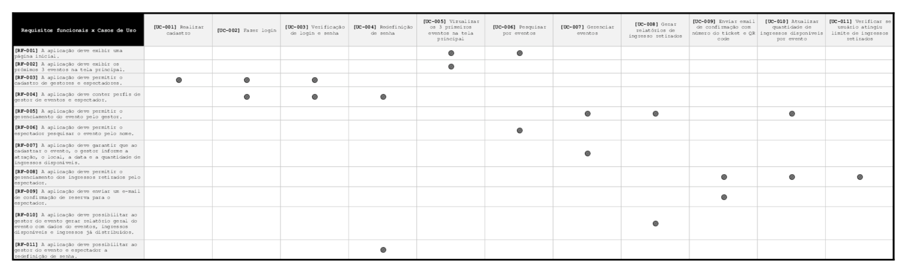
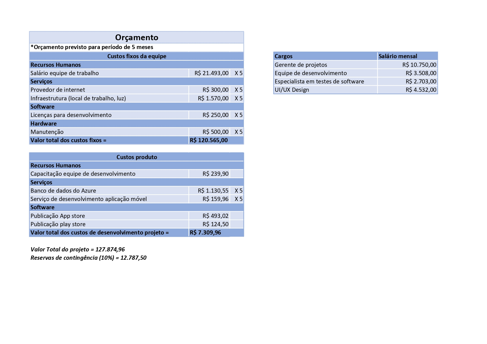

# Especificações do Projeto

Os membros da equipe realizaram um trabalho de imersão para consolidar a definição do problema e os pontos mais relevantes a serem abordados neste projeto, contando com a participação dos usuários por meio de observações em seu ambiente habitual, estudos e pesquisas. Os detalhes coletados foram organizados em personas e histórias de usuários para guiar o design e desenvolvimento do produto ou serviço.

## Personas

Durante o processo de estudo foram coletadas informações como idade, ocupação, motivação e frustrações. das personas identificadas durante o processo de entendimento do problema. As personas são apresentadas nas figuras a seguir:

|     |     |     |
| --- | --- | --- |

| **Ricardo lima - 43 anos**

                    | **Ocupação:** Prefeito de Quartel São João Mg.                            | **Dispositivos:** Notebook, Smartphone e Tablet.        |

| **Motivações:** Buscas constantementes para aprimorar a gestão pública de sua cidade.. | **Frustrações:** Recursos financeiros limitados, infraestrutura precaria. | **Hobbies:** Leitura, caminhadas e sair com a familia . |

|     |     |     |
| --- | --- | --- |

| **Luciana Texeira - 21 anos**

| **Ocupação:** Estudante de farmacia. | **Dispositivos:** Smartphone e Notebook. |
| **Motivações:** Formar e conseguir a independencia financeira. | **Frustrações:** Cidade pequena com poucas oportunidades de emprego. | **Hobbies:** Sair com amigos para se divertir e natação. |

|     |     |     |
| --- | --- | --- |

| **Rogério Martins - 38 anos**

| **Ocupação:** Produtor de eventos. | **Dispositivos:** Smartphone, Notebook e tablet. |
| **Motivações:** Proporcionar momentos memoráveis e unicos para publico. | **Frustrações:** Orçamentos restritos das prefeituras, concorrência acirrada e alterações climaticas. | **Hobbies:** Teatro, cozinhas para os amigos e viagens. |

|     |     |     |
| --- | --- | --- |

| **Maria Julia Souza - 15 anos**

| **Ocupação:** Colegial. | **Dispositivos:** Smartphone. |
| **Motivações:** Sonha em ser uma ifluencer digital. | **Frustrações:** Falta de diversidade cultural, monotonia e acesso limitado de tecnologia. | **Hobbies:** Assitir series, passeios com amigos da escola e tiktok. |

## Histórias de Usuários

Com base na análise das personas identificadas na etapa anterior, foram identificadas as seguintes histórias de usuários:

| EU COMO... `PERSONA` | QUERO/PRECISO ... `FUNCIONALIDADE` | PARA ... `MOTIVO/VALOR` |
| -------------------- | ------------------------------------------------------------------------------- | ------------------------------------------------------------------------------------------------------------------------------------------ |
| Espectador           | Visualizar os eventos disponíveis na minha cidade                               | Escolher qual evento melhor se adapta aos meus interesses e agenda.                                                                        |
| Espectador           | Realizar a compra de ingressos de eventos do meu interesse de forma online      | Garantir o meu ingresso para o evento em qualquer horário e de forma mais rápida, sem ter que me deslocar a uma bilheteria física.         |
| Espectador           | Receber meus ingressos de acesso ao evento em formato virtual                   | Evitar o deslocamento para retirada ou impressão do ingresso físico.                                                                       |
| Gestor do evento     | Realizar o controle de retirada de ingressos de um evento de forma automatizada | Ter maior controle e acesso mais rápido a informações relevantes, como número de participantes, para melhor adequar a estrutura do evento. |
| Gestor do evento     | Entregar para o espectador do evento um ingresso virtual                        | Reduzir os custos da fase de distribuição de ingressos, eliminando a impressão e equipes envolvidas na logística de entrega dos ingressos. |
| Gestor do evento     | Fornecer ingressos confiáveis que permitam validação rápida no acesso ao evento | Evitar ação de cambistas e falsificação de ingressos.                                                                                      |

## Requisitos

As tabelas que se seguem apresentam os requisitos funcionais e não funcionais que detalham o escopo do projeto.
Os requisitos funcionais são a funcionalidades essenciais para o funcionamento da aplicação.
Os requisitos não funcionais não impedem o funcionamento da aplicação e está relacionadao diretamente em como as funcionalidades serão entregues ao usuário do software.

### Requisitos Funcionais

| ID     | Descrição do Requisito                                                                                                                                     | Prioridade |
| ------ | ---------------------------------------------------------------------------------------------------------------------------------------------------------- | ---------- |
| RF-001 | A aplicação deve exibir uma página inicial.                                                                                                                | ALTA       |
| RF-002 | A aplicação deve exibir os próximos 3 eventos na tela principal.                                                                                           | ALTA      |
| RF-003 | A aplicação deve permitir o cadastro de gestores e espectadores.                                                                                           | ALTA       |
| RF-004 | A aplicação deve conter perfis de gestor de eventos e espectador.                                                                                          | ALTA       |
| RF-005 | A aplicação deve permitir o gerenciamento do evento pelo gestor.                                                                                           | ALTA       |
| RF-006 | A aplicação deve permitir o espectador pesquisar o evento pelo nome.                                                                                       | ALTA       |
| RF-007 | A aplicação deve garantir que ao cadastrar o evento, o gestor informe a atração, o local, a data e a quantidade de ingressos disponíveis.                  | ALTA       |
| RF-008 | A aplicação deve permitir o gerenciamento dos ingressos retirados pelo espectador.                                                                         | ALTA       |
| RF-009 | A aplicação deve enviar um e-mail de confirmação de reserva para o espectador.                                                                             | MÉDIA      |
| RF-010 | A aplicação deve possibilitar ao gestor do evento gerar relatório geral do evento com dados do eventos, ingressos disponíveis e ingressos já distribuídos. | BAIXA      |
| RF-011 | A aplicação deve possibilitar ao gestor do evento e espectador a redefinição de senha. | BAIXA      |

### Requisitos não Funcionais

| ID      | Descrição do Requisito                                                                                                                                   | Prioridade |
| ------- | -------------------------------------------------------------------------------------------------------------------------------------------------------- | ---------- |
| RNF-001 | O aplicativo deve ser compatível com uma variedade de dispositivos móveis e tablets, adaptando-se automaticamente ao tamanho da tela e à orientação do dispositivo.                                                                                     | ALTA      |
| RNF-002 | O tempo máximo de processamento das requisições do usuário deve ser de 10 segundos para garantir uma experiência responsiva.                                                                                      | BAIXA      |
| RNF-003 | Apenas usuários previamente cadastrados e autenticados podem gerar ingressos no aplicativo móvel.                                                                            | AlTA      |
| RNF-004 | O aplicativo deve ser compatível com os principais sistemas operacionais móveis, como iOS e Android, e suas versões mais recentes.                                                                                | ALTA       |
| RNF-005 | 5. O aplicativo deve seguir as melhores práticas de otimização para dispositivos móveis, incluindo técnicas de SEO para garantir uma alta visibilidade nos resultados de busca em dispositivos móveis. Isso envolve otimização on-page e a facilitação do rastreamento pelos motores de busca móveis. | MÉDIA       |

Com base nas Histórias de Usuário, enumere os requisitos da sua solução. Classifique esses requisitos em dois grupos:

* [Requisitos Funcionais
  (RF)](https://pt.wikipedia.org/wiki/Requisito_funcional):
  correspondem a uma funcionalidade que deve estar presente na
  plataforma (ex: cadastro de usuário).
* [Requisitos Não Funcionais
  (RNF)](https://pt.wikipedia.org/wiki/Requisito_n%C3%A3o_funcional):
  correspondem a uma característica técnica, seja de usabilidade, 
  desempenho, confiabilidade, segurança ou outro (ex: suporte a
  dispositivos iOS e Android).
  Lembre-se que cada requisito deve corresponder à uma e somente uma
  característica alvo da sua solução. Além disso, certifique-se de que
  todos os aspectos capturados nas Histórias de Usuário foram cobertos.

## Restrições

O projeto está restrito pelos itens apresentados na tabela a seguir.

| ID      | Restrição                                                                                                                            |
| ------- | ------------------------------------------------------------------------------------------------------------------------------------ |
| RST-001 | O projeto deverá ser entregue até o final do semestre                                                                                |
| RST-002 | A geração de ingressos estará sujeita a uma restrição, sendo permitida a emissão de no máximo 3 unidades por usuário em cada evento. |
| RST-003 | O desenvolvimento da solução não poderá ser subcontratado                                                                            |

## Diagrama de Casos de Uso

Um diagrama de caso de uso é uma representação gráfica que mostra como atores (usuários ou sistemas) interagem com um sistema de software e descreve as principais funcionalidades oferecidas por esse sistema. Abaixo está representado o diagrama de casos de uso da aplicação EventPASS.

Diagrama de casos de uso - Eventpass

## Matriz de Rastreabilidade 

Um mapa que liga as diferentes partes do seu projeto de software. Essa é a função da matriz de rastreabilidade: mostrar como requisitos, testes, código e outros elementos se conectam.

[Planilha da matriz de rastreabilidade](https://docs.google.com/spreadsheets/d/1i9YdljaMsSj78sXelSdsZjyGHYDCyhwvTVoLRVwG2jE/edit?usp=sharing)

## Gestão de Tempo

O acompanhamento do cronograma é o processo de monitoramento do progresso do projeto para atualizar o progresso e gerenciar as mudanças a partir da linha de base.

## Gestão do Orçamento

O orçamento estabelecido prevê a execução do projeto em um prazo de 5 meses.

## Plano de Gerenciamento de Recursos

### 1. Equipe do Projeto

* Fernanda Marques Assis
* Júlia Chaves Dutra
* Luiz Eduardo Possidonio
* Pedro Celso Mendes
* Samara Karoline de Almeida Costa
* Sandro Shayne Dutra

### 2. Organograma da Equipe

### 3. Diretório da Equipe do Projeto

| Nome             | Função                 | Contato          |
| ---------------- | ---------------------- | ---------------- |
| Sandro Shayne    | Gerente de Projeto     | (31) 9 9697-7420 |
| Luiz Eduardo     | Especialista em Testes | (31) 9 8663-0589 |
| Fernanda Marques | UI/UX Design           | (31) 9 9958-7394 |
| Júlia Chaves     | Desenvolvedora         | (31) 9 9624-0052 |
| Samara Almeida   | Desenvolvedora         | (31) 9 9909-7590 |
| Pedro Celso      | Desenvolvedor          | (31) 9 9388-4893 |

### 4. Papéis e Responsabilidades

* **Gerente de Projeto:**
  Responsável por coordenar as atividades de desenvolvimento, definir metas e prazos, além de garantir a comunicação eficaz entre os membros da equipe e o progresso do projeto de acordo com o cronograma estabelecido.

* **UI/UX Designer:**
  Responsável por criar designs de interface de usuário atraentes e intuitivos, utilizando ferramentas como Adobe XD ou Figma, garantindo uma experiência de usuário positiva em todo o aplicativo.

* **Especialista de Testes:**
  Encarregado de planejar e executar testes de unidade e aceitação no aplicativo, a fim de garantir a estabilidade e a qualidade do software.

* **Desenvolvedores:**
  Encarregados de desenvolver a lógica de negócios e implementar a interface do usuário utilizando o React Native, garantindo uma experiência consistente e responsiva em dispositivos Android.

### 5. Contratação de Novos Recursos e Substituição de Membros do Time

Ficou acordado que o Gerente de Projeto possui a responsabilidade e a autoridade de realizar a contratação de novos recursos e substituição de membros da equipe (caso necessário). O Gerente de Projeto irá acompanhar, durante todo o ciclo de vida do projeto, como os recursos estão distribuídos garantindo que estejam disponíveis para a atividade correta e no tempo hábil. Em caso de necessidade de realocação de recursos, o Gerente de Projeto irá avaliar as competências necessárias, os recursos disponíveis e decidir a melhor alternativa visando sempre a escolha mais assertiva para o bom andamento do projeto.

### 6. Treinamentos Necessários e Acessoria

Toda a equipe irá realizar a trilha de aprendizagem do micro-fundamento “Desenvolvimento de Aplicações Móveis” disponível no Eixo 3 a fim de se capacitar para o desenvolvimento deste projeto, utilizando o React Native. Em caso de necessidade de algum auxílio ou assessoria o Gerente de Projeto ou algum outro membro da equipe irá contatar o orientador do projeto visando obter o suporte necessário.

### 7. Avaliação de Resultados

Os procedimentos de avaliação de resultados da equipe serão realizados através de reuniões semanais com todos os envolvidos onde serão avaliadas todas as evoluções feitas até o momento, bem como os próximos passos que precisam ser dados para a continuidade do projeto, tendo como base tudo o que já foi concluído e o que ainda necessita ser realizado.

### 8. Ferramentas de Colaboração

* **Comunicação:** Whatsapp e Teams, para comunicação entre membros da equipe.
* **Gestão de Tarefas:** GitHub, para acompanhamento e atribuição de tarefas.
* **Controle de Versão:** Git e GitHub, para gerenciamento de código fonte e colaboração entre os desenvolvedores.

### 9. Tecnologias Utilizadas

* **Desenvolvimento:** React Native.
* **Ferramentas de Design:** Adobe XD ou Figma.
* **Testes:** A definir.

### 10. Recursos Físicos Utilizados

* Computadores Desktop (6)
* Monitores (6)
* Periféricos:
  + Teclados (6)
  + Mouse (6)
  + Fones de Ouvido (6)
* Roteadores de Wi-Fi
